# SobatNavi RAG AI Algorithm & Flowchart

Dokumen ini menjelaskan alur kerja dari sistem RAG (Retrieval-Augmented Generation), Clustering, dan TOPSIS Ranking pada SobatNavi AI Agent (Heidi) dari request masuk hingga response dikembalikan.

## 1. High-Level Architecture Flow

```mermaid
sequenceDiagram
    participant Client as Frontend / User
    participant API as FastAPI (api.py)
    participant LLM as OpenAI (Heidi)
    participant RAG as RAG & Recommender Engine
    participant DB as Supabase (pgvector & PostGIS)
    participant TomTom as TomTom Routing API

    Client->>API: POST /api/chat (message, budget_preference)
    
    rect rgb(30, 41, 59)
    note right of API: Phase 1: Pre-processing & Budgeting
    API->>API: Parse message (pace, days, custom places)
    API->>API: Calculate POI Budget (attractions & meals per day)
    API->>API: Map budget_preference -> preference_mode (budget/standard/luxury)
    API->>API: Build System Prompt (inject constraints & JSON schema)
    end
    
    API->>LLM: Start Chat Loop (message + prompt + history)
    
    rect rgb(15, 30, 45)
    note right of LLM: Phase 2: Agentic RAG (Tool Calling Loop)
    loop Max 20 Iterations
        LLM->>RAG: Call get_smart_recommendations(query, category)
        RAG->>DB: match_poi_attractions (OpenAI Embedding 768-d)
        DB-->>RAG: Top 3x limit POIs (Semantic Search)
        RAG->>RAG: Bali BBox Filter -> DBSCAN Clustering -> TOPSIS Ranking
        RAG-->>LLM: Return Top Ranked & Clustered Places
        
        LLM->>RAG: Call get_nearby_food_and_lodging() / get_bali_context()
        RAG->>DB: PostGIS Radius Search / Odalan Check
        DB-->>RAG: Results
        RAG-->>LLM: Return Data
    end
    end
    
    LLM-->>API: Yield FinalAIResponse (Structured JSON)
    
    rect rgb(30, 41, 59)
    note right of API: Phase 3: Backend Post-Processing
    API->>API: Parse JSON & Coerce Categories
    API->>API: guarantee_base_hotel() (Fallback if LLM missed it)
    API->>RAG: inject_meals_to_itinerary()
    RAG->>DB: Radius / Semantic search for restaurants
    DB-->>RAG: Restaurants
    RAG-->>API: Injected Places Array
    
    API->>TomTom: calculate_batch_routes() for all places
    TomTom-->>API: Polylines, travel times, distances
    API->>API: Inject route_to_next into places
    end
    
    API->>DB: Save Chat & Itinerary
    API-->>Client: 200 OK (FinalAIResponse)
```

---

## 2. RAG & Recommendation Algorithm Detail (`app/engine/recommender.py`)

Saat LLM memanggil tool `get_smart_recommendations`, sistem tidak sekadar mengembalikan hasil semantic search mentah. Sistem akan melakukan **Spatial Clustering** dan **Multi-Criteria Decision Making (MCDM)** agar tempat yang direkomendasikan berkualitas tinggi, berdekatan, dan relevan dengan preferensi user.

### Alur `cluster_and_rank_pois`:

1.  **Semantic Vector Search (`supabase_service.py`)**:
    *   Sistem mengubah `query` text dari LLM (misal: `"pantai sunset bali"`) menjadi vector embedding (768 dimensi) menggunakan model OpenAI.
    *   Memanggil RPC `match_poi_attractions` di Supabase untuk melakukan cosine similarity search di PostgreSQL (`pgvector`).
    *   *Optimalisasi*: Sistem selalu mem-fetch **3x lipat** dari batas jumlah yang diminta (`limit * 3`) untuk memastikan banyak kandidat saat filtering.

2.  **Geographic Pre-Filter (Bali Bounding Box)**:
    *   Sistem menghapus semua POI yang koordinatnya berada di luar pulau Bali (lat `-8.9` s.d `-8.05`, lng `114.35` s.d `115.75`) untuk membuang outlier/data rusak.

3.  **DBSCAN Radius Calculation**:
    *   Sistem menghitung rentang/sebaran geografis (dalam km) dari semua POI yang di-fetch.
    *   Radius DBSCAN dihitung dinamis: `spread_km / (num_clusters * 1.5)`.
    *   **Hard Cap**: Radius **dibatasi secara ketat** maksimal 20 km untuk Atraksi & Restoran, dan 25 km untuk Hotel. Ini mencegah satu cluster mencakup area yang tidak masuk akal untuk dikendarai dalam sehari.

4.  **TOPSIS Scoring (Technique for Order of Preference by Similarity to Ideal Solution)**:
    *   Setiap POI dinilai berdasarkan multi-kriteria: `rating`, `popularity`, `price_value`, `strategic_score`, `visual_interest`.
    *   **Budget Awareness**: Bobot (weights) dan dampak (impacts) diubah secara dinamis berdasarkan `preference_mode`:
        *   `budget`: `price_value` di-boost bobotnya menjadi 35% (makin murah makin bagus).
        *   `luxury`: Dampak `price_value` dibalik menjadi `-1` (makin mahal makin bagus, mengindikasikan eksklusivitas).
    *   TOPSIS menghitung skor (0.0 s/d 1.0) berdasarkan kedekatan dengan nilai ideal positif dan kejauhan dari nilai ideal negatif.

5.  **DBSCAN Spatial Clustering**:
    *   Titik-titik dikelompokkan secara spasial (menggunakan *Haversine metric* di atas radian bumi).
    *   *Fallback*: Jika semua titik menjadi outlier (noise), DBSCAN diulang dengan radius yang sedikit lebih besar (maks 1.5x dari radius awal, tetap mengikuti hard cap).

6.  **Iterative Centroid Distance Filter (Anti-Chaining)**:
    *   DBSCAN dapat menyebabkan *chaining* (A dekat B, B dekat C, sehingga A dan C masuk cluster sama walau jaraknya 40km).
    *   Sistem menghitung titik tengah (*centroid*) dari masing-masing cluster.
    *   Sistem mendepak/membuang POI yang berjarak lebih dari **20 km** dari centroid clusternya sendiri.
    *   Diulang (maks 3x iterasi) hingga centroid stabil dan tidak ada lagi POI yang dibuang.

7.  **Ranking & Selection**:
    *   Sistem memilih cluster terbaik berdasarkan rata-rata skor TOPSIS dari anggota cluster tersebut.
    *   Di dalam setiap cluster terpilih, POI diurutkan berdasarkan skor TOPSIS tertinggi.
    *   Sistem mengambil `top_n_per_cluster` POI teratas untuk setiap harinya.

---

## 3. Post-Processing & Meal Injection

Setelah LLM mengembalikan JSON `FinalAIResponse`, sistem backend Python mengambil alih (tidak membebani token LLM):

1.  **Hotel Guarantee**: 
    Memastikan `base_hotel` terisi. Jika LLM gagal memilih hotel, backend otomatis memanggil semantic search hotel (berdasarkan `preference_mode` dan `district_hint`) dan memasukkannya.
2.  **Meal Injection**: 
    Menyisipkan otomatis slot restoran (`sarapan` jam 08:00, `makan siang` jam 12:30, `makan malam` jam 19:00).
    *   Mencari restoran *nearby* (radius 5km) dari centroid tempat wisata di hari tersebut (menggunakan PostGIS).
    *   Jika gagal, melakukan semantic fallback. Query restoran disesuaikan dengan `budget_preference`:
        *   `budget` -> `"warung makan murah ... harga terjangkau"`
        *   `luxury` -> `"restoran fine dining mewah ... premium"`
3.  **TomTom Routing Pipeline**:
    Menyusun rute dari hotel -> tempat 1 -> tempat 2 -> dst. Memanggil API TomTom Batch Routing untuk mengambil `distance_km`, `travel_time_mins`, dan `polyline` (untuk digambar di peta).
